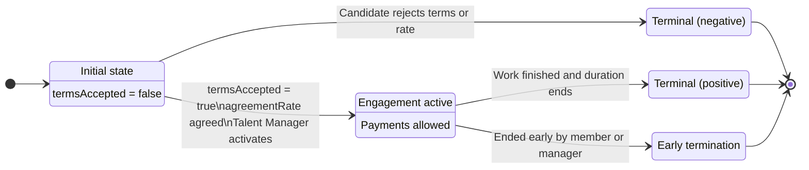

# Assignment Status Flow

This diagram describes how an engagement assignment moves between statuses and the conditions for each transition.

```mermaid
stateDiagram-v2
  direction LR

  [*] --> SELECTED
  SELECTED : Initial state
  SELECTED : termsAccepted = false

  SELECTED --> OFFER_REJECTED : Candidate rejects terms or rate
  SELECTED --> ASSIGNED : termsAccepted = true\nagreementRate agreed\nTalent Manager activates

  ASSIGNED : Engagement active
  ASSIGNED : Payments allowed

  ASSIGNED --> COMPLETED : Work finished and duration ends
  ASSIGNED --> TERMINATED : Ended early by member or manager

  OFFER_REJECTED : Terminal (negative)
  COMPLETED : Terminal (positive)
  TERMINATED : Early termination

  OFFER_REJECTED --> [*]
  COMPLETED --> [*]
  TERMINATED --> [*]
```
