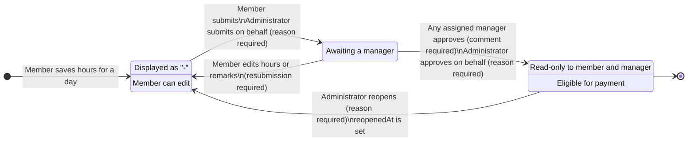

# Timesheet Workflow

How a timesheet entry moves between statuses, who may move it, and what each move records.

A timesheet entry is one member's hours for one calendar day on one engagement assignment. Entries hang off
`EngagementAssignment`, so "one entry per member per engagement per day" is a database unique constraint rather
than a rule application code has to remember.

## Status flow



There is deliberately **no rejection status**. A manager who disagrees with an entry asks the member to edit it,
which returns it to `DRAFT`, or escalates to an administrator. Adding `REJECTED` would have to answer every
question `DRAFT` already answers - can a member edit it, can a manager approve it - with the same answers.

Reopening likewise returns an entry to `DRAFT` rather than introducing a fourth status. The fact that the entry
was once approved survives in `reopenedAt` plus the `REOPENED` audit record, which is what the UI badges from.

## Status semantics

| Status | Displayed as | Member can edit | Manager can approve | Payable |
| --- | --- | --- | --- | --- |
| `DRAFT` | `-` | yes | no | no |
| `SUBMITTED` | `Submitted` | yes, but the entry resets to `DRAFT` | yes | no |
| `APPROVED` | `Approved` | no | no, already approved | yes |

## Who is who

Authorization is resolved per assignment, server-side, before any endpoint touches an entry. The result is
returned to clients as `viewerRole` so the UI renders from a server decision rather than guessing from JWT
roles.

| Role | How it is established |
| --- | --- |
| `MEMBER` | the caller is the assignment's `memberId` |
| `MANAGER` | a live `EngagementManager` row exists for the assignment's engagement (`removedAt IS NULL`) |
| `ADMINISTRATOR` | the caller holds a `PrivilegedUserRoles` role, or is a machine token with `manage:timesheets` |

`PrivilegedUserRoles` **is** the administrator definition for timesheets: `Administrator` plus the Topcoder
Project, Task, and Talent Manager platform roles.

Note the asymmetry, which is load-bearing rather than incidental. A platform manager role makes someone an
**administrator** here, not an approving **manager**. Manager authority comes only from an `EngagementManager`
row. So a Topcoder Project Manager who is not assigned to an engagement acts on its timesheets through the
administrator path - override reason required, audited as `ADMIN_OVERRIDE` - rather than approving as a manager.
That is what stops the audit requirements being sidestepped by a role that merely has "manager" in its name.

A caller with none of those relationships receives **`404`**, never `403`. A `403` would confirm that the
assignment exists, which is enough to enumerate assignment ids by probing.

## Role x action matrix

| Action | Member (assignee) | Assigned manager | Administrator | Unrelated caller |
| --- | --- | --- | --- | --- |
| Read the timesheet | yes | yes | yes | `404` |
| Create or edit a draft | yes | `403` | yes | `404` |
| Edit a submitted entry | yes, resets to `DRAFT` | `403` | yes | `404` |
| Edit an approved entry | `409` | `409` | yes, reason required | `404` |
| Submit | yes | `403` | yes, reason required | `404` |
| Approve | `403` | yes, comment required | yes, reason + comment required | `404` |
| Reopen an approved entry | `403` | `403` | yes, reason required | `404` |
| List timesheets (landing) | n/a | own engagements only | all eligible | empty or `403` |
| Read an entry's audit history | `403` | `403` | yes | `404` |

Every administrator action that overrides a member's or a manager's work requires a reason, and that reason is
recorded with the administrator's identity, the timestamp, and the previous value and status.

## Derived transitions

The status resulting from a write is **derived by the server** by comparing stored values with incoming ones.
Any status a client sends is ignored - the global `ValidationPipe` runs with `whitelist: true`, so an unknown
field never reaches the service in the first place, and the service does not read one either.

| Stored | Incoming change | Result | Audit action |
| --- | --- | --- | --- |
| *(no row)* | a valid entry | created as `DRAFT` | `CREATED` |
| `DRAFT` | hours or remarks differ | stays `DRAFT` | `UPDATED` |
| `SUBMITTED` | hours or remarks differ | → `DRAFT`, `submittedAt`/`submittedBy` cleared | `UNSUBMITTED` |
| `SUBMITTED` | nothing material differs | no-op, no audit noise | *(none)* |
| `APPROVED` | member or manager caller | `409` | *(none)* |
| `APPROVED` | administrator with a reason | applied, previous values preserved | `ADMIN_OVERRIDE` |
| `APPROVED` | administrator with no reason | `400` | *(none)* |

A transition on one entry never affects its siblings in the same request: a member editing one of five submitted
days resets that day and leaves the other four `SUBMITTED`.

## Concurrent approval

Approval is a single conditional update guarded on the entries still being `SUBMITTED`, and that guard is the
entire concurrency control - no row locks, no retries:

```sql
UPDATE "EngagementTimesheetEntry"
   SET status = 'APPROVED', ...
 WHERE id IN (:entryIds) AND status = 'SUBMITTED'
```

Two managers approving the same selection at the same moment therefore approve every entry exactly once. The
entries the guard skipped come back in the response with the status they actually had and the handle of the
manager who got there first, rather than the whole batch failing:

```json
{
  "approved": ["entry-1", "entry-2", "entry-3"],
  "skipped": [{ "id": "entry-4", "currentStatus": "APPROVED", "approvedByHandle": "maryj" }]
}
```

## Validation

| Rule | Behaviour |
| --- | --- |
| Hours must be numeric, decimals allowed | `8`, `8.5`, `9.5` accepted; anything unparseable is `400` |
| Hours must not be negative | `400` |
| Hours must not exceed 24 for one day | `400`. A soft warning above the assignment's `standardHoursPerDay` is a UI concern |
| A date range must not span more than 31 days | `400`, on both reads and writes |
| `toDate` must not precede `fromDate` | `400` |
| The same work date twice in one payload | `400` |
| Entries outside the assignment's start/end dates | **allowed** - assignment dates are often set loosely - and returned with `outsideAssignmentWindow: true` so the administrator view can flag them |

Hours are stored as `DECIMAL(5,2)` and travel as strings. Approved hours become a payment amount, so they must
sum exactly; a JSON number would put them through a float on the way.

## Audit trail

Every mutation writes an `EngagementTimesheetAudit` record **inside the same transaction as the change**, so a
mutation that succeeds while its audit record fails is impossible in both directions. Each record carries the
action, previous and updated values and statuses, the actor's id, handle and role, the timestamp, and the
approval comment or override reason.

Entry-scoped rows carry `timesheetEntryId`; manager assignment and removal are engagement-scoped and carry
`engagementId` instead. Exactly one of the two is set on every row, enforced by a database check constraint.

## Lifecycle events

Emitted on the bus as each mutation commits. Emails are a later release, but the emit points are the same lines
the audit writer already touches, so adding them now avoided reopening every mutation later. An event failure is
logged and never fails the mutation.

| Topic | When |
| --- | --- |
| `engagement.timesheet.submitted` | entries submitted, including on a member's behalf |
| `engagement.timesheet.unsubmitted` | a submitted entry was edited and reset to draft |
| `engagement.timesheet.approved` | entries approved |
| `engagement.timesheet.reopened` | an administrator reopened approved entries |
| `engagement.timesheet.overridden` | an administrator changed an approved entry |

## Endpoints

See [`TIMESHEET_API.md`](./TIMESHEET_API.md) for the request and response contract.

| Method | Path |
| --- | --- |
| `GET` | `/engagements/:engagementId/assignments/:assignmentId/timesheets` |
| `PUT` | `/engagements/:engagementId/assignments/:assignmentId/timesheets/entries` |
| `POST` | `/engagements/:engagementId/assignments/:assignmentId/timesheets/submit` |
| `POST` | `/engagements/:engagementId/assignments/:assignmentId/timesheets/approve` |
| `POST` | `/engagements/:engagementId/assignments/:assignmentId/timesheets/reopen` |
| `GET` | `/engagements/:engagementId/assignments/:assignmentId/timesheets/entries/:entryId/audit` |
| `GET` | `/timesheets/engagements` |

None of these declares a scope. `PermissionsGuard` refuses every non-administrator human once scopes are
declared, and members and managers are exactly who these endpoints are for, so the guard enforces authentication
and the service resolves authorization per assignment - the same shape as the member-facing engagements
endpoints.
